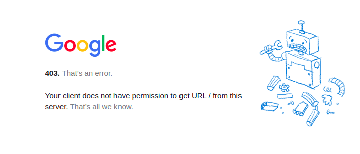

# no-sanction

## Introduction

<p align="center">
  
</p>
  
**Tired of seeing this page?** Have you ever wondered why you should even face this problem? If you think you DO DESERVE a normal life like others all around the world, stand up for your rights.

There are many unfair sanctions against our country, here I want to describe the ways in which I can switch services and etc to have nicer experience with whom respects my nationality.
The rule of thumb here is not to use online services as you can.

## Do you have some sympathy too?
If you've substituted a service with a one under sanctions and you are satisfied with it, let us all know!!!

## Resources

- [Awesome Privacy](https://github.com/pluja/awesome-privacy)
- [Sites that sanction Iran](https://gist.github.com/alibo/dfd7c258bcc44a0e8c9f7c5bfd3bd2c3)

## Services ⚙️

### Gmail

[@1995parham](https://github.com/1995parham):
I have switched to [Tutanota](https://mail.tutanota.com/) instead of gmail. the experience is great and you can buy its subscription with the help of [Iranicard](https://www.iranicard.ir/) without any problem.
The switching process is easy but you must somehow let the others know about your new email and I am using the vacation responder of gmail.
The persian support is good and its font also readable to me. it doesn't have any label system and cannot follow threads but I think these features are unique to gmail.
I am using folders and archive emails instead of tagging them and follow thread manually by email itself.

### Chrome

#### Browser and Bookmarks

[@1995parham](https://github.com/1995parham):
Firefox is awesome 💃. It works for me on reading and checking the websites. I don't use browsers for listening to music etc.

#### Password Manager

[@1995parham](https://github.com/1995parham):
I store my passwords using [gopass](https://github.com/gopasspw/gopass) on Github.

### DockerHub

[@1995parham](https://github.com/1995parham):
Github container registry is faster, free and respects nationalities. you only needs to build and push your images into it by using the github actions.
consider the following example:

```yaml
docker:
  name: docker
  runs-on: ubuntu-latest
  needs:
    - lint
    - test
  steps:
    - uses: actions/checkout@v2
    - uses: docker/setup-qemu-action@v1
    - uses: docker/setup-buildx-action@v1
    - uses: docker/login-action@v1
      with:
        registry: ghcr.io
        username: ${{ github.repository_owner }}
        password: ${{ secrets.GITHUB_TOKEN }}
    - uses: docker/metadata-action@v3
      id: meta
      with:
        images: ghcr.io/1995parham/saf
        tags: |
          type=ref,event=branch
          type=ref,event=pr
          type=semver,pattern={{version}}
          type=semver,pattern={{major}}.{{minor}}
    - uses: docker/build-push-action@v2
      with:
        file: "build/package/Dockerfile"
        context: .
        platforms: linux/amd64
        push: true
        tags: ${{ steps.meta.outputs.tags }}
        labels: ${{ steps.meta.outputs.labels }}
```

### Docker

[@1995parham](https://github.com/1995parham):
[Podman](https://github.com/containers/podman) is a safer alternative to docker with a more welcoming community. I only use it on linux,
and it needs more time to setup comparing to docker but it doesn't solve the dockerhub sanctions. you can check my setup from [dotfiles](https://github.com/1995parham/dotfiles/blob/main/scripts/docker.sh#L72).

### Google Keep

[@1995parham](https://github.com/1995parham):
I write my notes on emacs [org-mode](https://orgmode.org/) and sync it with Github. you need learn org-mode first and for it toke 3 or 4 weeks.

### Overleaf

[@1995parham](https://github.com/1995parham):
I write my latex document on my own system. with some scripts is far better than overleaf experience. you check my [dotfiles](https://github.com/1995parham/dotfiles/blob/main/scripts/texlive.sh) to installing texlive.

[@elahe-dastan](https://github.com/elahe-dastan):
I used to write my thesis in latex using overleaf, it's not only hard to write persian in overleaf but also makes me frustrated that everyday I should change my VPN cause the former one is recognized so I started to use emacs and keep the files on my github repo, even the experience of writing persian in emacs is way better.

### Trello

[@1995parham](https://github.com/1995parham):
I use emacs [org-mode](https://orgmode.org/) for my tasks, tracking them and etc. without any problem. I also sync them with Github.

### Golang

[@1995parham](https://github.com/1995parham):
Sadly I must use golang because it is my primary language but sites like [go.dev](https://go.dev/) are free but currently I am trying to switch.
Languages like [Rust](https://www.rust-lang.org/) or [Zig](https://ziglang.org/) are free and awesome replacement for Go.

### Dropbox, Google Drive

[@1995parham](https://github.com/1995parham):
I use [Syncthing](https://github.com/syncthing/syncthing) to share files between my system without any issue.

### Tensorflow

[@mhezarei](https://github.com/mhezarei): While developing Deep Learning models, one might need to read the framework's documents or download its pre-trained models. You need to get past the "sanction page" to do anything that needs downloading/loading from the Tensorflow website.

[PyTorch](https://pytorch.org/), on the other hand, won't bother you with any of these difficulties, and you can develop and learn about Deep Learning without any worries. It is a well-known framework that doesn't need much of an introduction.

PyTorch **will** provide you with almost everything Tensorflow offers with no form of sanctions or bans. You can read the website's documentation for more information.
